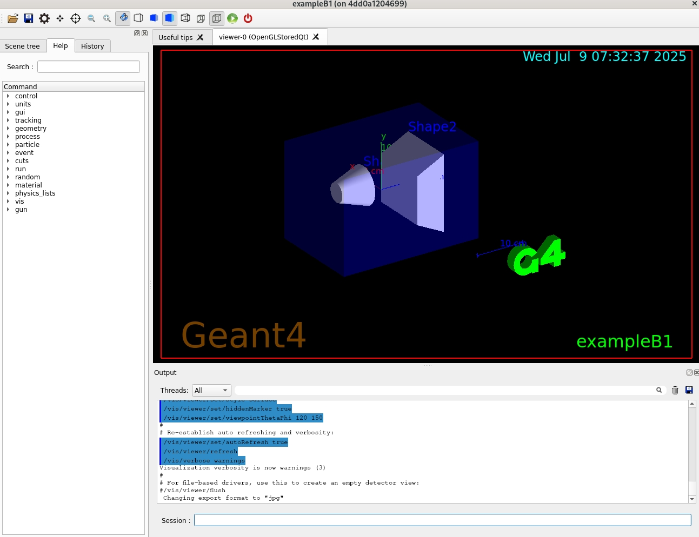
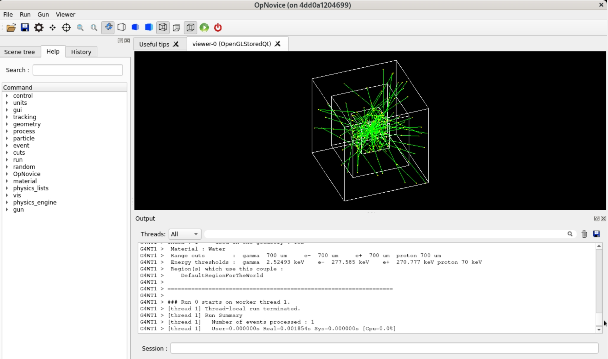

# Instruction

A Docker image is prepared to run the Geant4 examples. 
For your convenience, it is uploaded to Docker Hub: https://hub.docker.com/r/baikalschool/geant4

Please make sure you have setup Docker environment already. 
As a reference, installation of Docker in AlmaLinux 9 will be shown. 

If you are using Windows, you can consider to use WSL2 or VirtualBox. 

## Install Docker Engine in AlmaLinux9

If you have already installed the official Docker, please skip this section.

In some Linux distributions, some unofficial Docker could be installed. Please remove them first:
```bash
sudo dnf remove docker \
                  docker-client \
                  docker-client-latest \
                  docker-common \
                  docker-latest \
                  docker-latest-logrotate \
                  docker-logrotate \
                  docker-engine \
                  podman \
                  runc
```

Then, add the YUM repo of Docker:
```bash
sudo dnf -y install dnf-plugins-core
sudo dnf config-manager --add-repo https://download.docker.com/linux/rhel/docker-ce.repo
```

Install Docker:
```bash
sudo dnf install docker-ce docker-ce-cli containerd.io docker-buildx-plugin docker-compose-plugin
```

Start Docker:
```bash
sudo systemctl enable --now docker
```

Run hello-world in Docker:
```bash
sudo docker run hello-world
```

## Pull and start geant4 Docker container

Pull Docker image:
```bash
sudo docker pull baikalschool/geant4:el9
```

Start an instance:
```bash
sudo docker run -it baikalschool/geant4:el9 /bin/bash
```

By default, the container is cached. If you want to auto-delete the container after it finishes, add option `--rm`.  

If it is hard to download the image in your network, you can consider to get a tarball from other people.

Save and load an image:
```bash
docker save -o baikalschool-geant4-el9.tar baikalschool/geant4:el9
docker load -i baikalschool-geant4-el9.tar
```

## Geant4 visualization with Docker container

If your system (host) already setup X11 server, then you can configure your machine with following:
```bash
xhost +local:docker
```

Then create a container named baikal, with X11 configured:
```bash
docker run -it --name baikal -e DISPLAY=$DISPLAY -v /tmp/.X11-unix:/tmp/.X11-unix baikalschool/geant4:el9 /bin/bash
```

After the container is created, you can start it with following commands in the next time:
```bash
xhost +local:docker # This is necessary if need GUI
docker start baikal # if the container does not start. 
docker exec -it baikal /bin/bash # when a container is running, you can run it multiple times.
```

## Build and run the first example B1
If you are not inside the container yet, please run:
```bash
docker exec -it baikal /bin/bash
```

If there is no error, you will be inside a new shell, such as:
```bash
[root@4dd0a1204699 build]# 
```

If it is the first time you start the container, you will see nothing inside the `/build` directory:
```bash
[root@4dd0a1204699 build]# ls
```

You can copy the example B1 from following directory:
```bash
[root@4dd0a1204699 build]# cp -r /opt/geant4/share/Geant4/examples/basic/B1 .
```

Then build this example with following command:
```bash
[root@4dd0a1204699 build]# cmake -S B1 -B B1-build # configure
[root@4dd0a1204699 build]# cmake --build B1-build  # build
```

If you see following output, that means the example is built successfully:
```
[ 12%] Building CXX object CMakeFiles/exampleB1.dir/exampleB1.cc.o
[ 25%] Building CXX object CMakeFiles/exampleB1.dir/src/ActionInitialization.cc.o
[ 37%] Building CXX object CMakeFiles/exampleB1.dir/src/DetectorConstruction.cc.o
[ 50%] Building CXX object CMakeFiles/exampleB1.dir/src/EventAction.cc.o
[ 62%] Building CXX object CMakeFiles/exampleB1.dir/src/PrimaryGeneratorAction.cc.o
[ 75%] Building CXX object CMakeFiles/exampleB1.dir/src/RunAction.cc.o
[ 87%] Building CXX object CMakeFiles/exampleB1.dir/src/SteppingAction.cc.o
[100%] Linking CXX executable exampleB1
[100%] Built target exampleB1
```

Let's check if the Geant4 example and GUI works:
```bash
[root@4dd0a1204699 build]# cd B1-build/
[root@4dd0a1204699 B1-build]# ./exampleB1 
```

The GUI looks like following:


To simulate one event, you can click the "Run" button in the GUI toolbar, or type `/run/beamOn 1` in the command line. 

If you pressed the "Run" button multiple times, you will see the particles are generated randomly. 
You can also type `/run/beamOn 10` to simulate 10 events at once.

In the GUI, you can see the particles in different colors. Different colors reprensent the charge of the particles: negative charge represented by color red; positive charge represented by the color blue; neutral charge represented by the color green.


## Example B1

This example is a simple Geant4 application that simulates the passage of particles through a detector.

The geometry is defined in the `B1/src/DetectorConstruction.cc` file. 
It creates a world volume, an envelope volume, and two volumes inside the envelope: a spherical cone and a trapezoid.
The envelop volume is made of water, and the two volumes are made of tissue and bone. 
The trapezoid volume is used as a scoring volume to collect the deposited energy.

The default physics list is QBBC. This physics list requires data files for electromagnetic and hadronic processes.
If you are using the Geant4 Docker image, these data files are already included in the image.

The initial particles are defined in the `B1/src/PrimaryGeneratorAction.cc` file.
By default, it generates a 6 MeV gamma, randomly distributed in front of the envelope.

This example also collect deposited energy of each step in the "scoring" volume and then calculate the 
cumulated dose per run. 

## Example OpNovice

This example shows the optical photon simulation in Geant4.

Build and run the example:
```bash
[root@4dd0a1204699 build]# cd /build
[root@4dd0a1204699 build]# cp -r /opt/geant4/share/Geant4/examples/extended/optical/OpNovice .
[root@4dd0a1204699 build]# cmake -S OpNovice -B OpNovice-build
[root@4dd0a1204699 build]# cmake --build OpNovice-build
[root@4dd0a1204699 build]# cd OpNovice-build/
[root@4dd0a1204699 OpNovice-build]# ./OpNovice
```

Similar to the example B1, you can click the "Run" button in the GUI toolbar, or type `/run/beamOn 1` in the command line to simulate one event.


## More examples
Find more examples in Geant4 Reference: https://geant4-userdoc.web.cern.ch/Doxygen/examples_doc/html/index.html